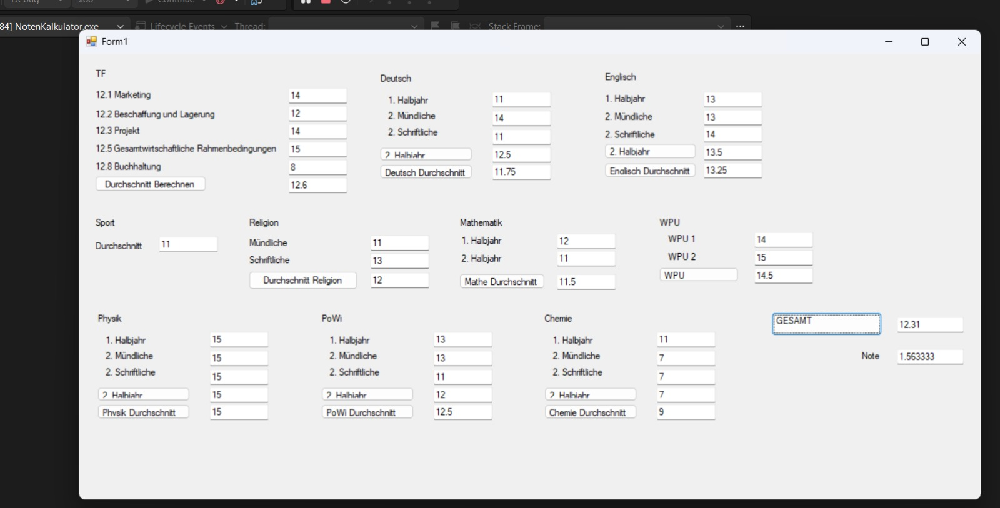

# NotenKalkulator 📊

A clean and simple Windows Forms application built with Visual Basic to calculate semester averages and final grades across multiple subjects. 

## Features
* **Subject-Specific Calculations:** Calculate averages for core subjects (Deutsch, Englisch, Mathematik) by combining half-year, oral, and written scores.
* **Specialized Subjects (TF):** Includes grade calculations for specialized modules like Marketing, Buchhaltung, and Project work.
* **Overall Average:** Automatically computes the total point average across all 10 subject categories.
* **Final Grade (Note) Conversion:** Converts the overall point average into a final numeric grade using the standard formula `(17 - Gesamt) / 3`.

## Technologies Used
* **Language:** Visual Basic .NET (VB.NET)
* **UI Framework:** Windows Forms (.NET Framework 4.0)
* **IDE:** Visual Studio

## How to Run
1. Clone or download this repository.
2. Open the `NotenKalkulator.sln` solution file in Visual Studio.
3. Press `F5` or click **Start** to build and run the application.
4. Enter your points in the respective text boxes and click the calculation buttons to see your averages!

## Repository Structure
* `Form1.vb` & `Form1.Designer.vb`: Contains the main application logic and UI layout.
* `NotenKalkulator.vbproj` / `.sln`: Visual Studio project and solution configuration files.
* `screenshot_1.jpeg`: Application UI preview.
